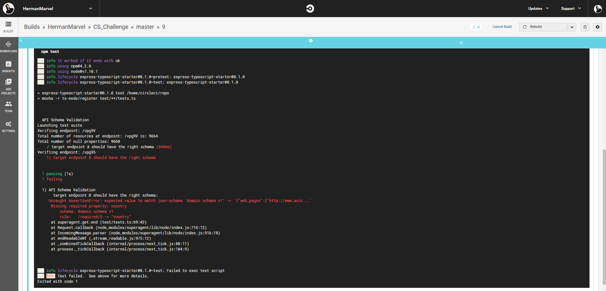
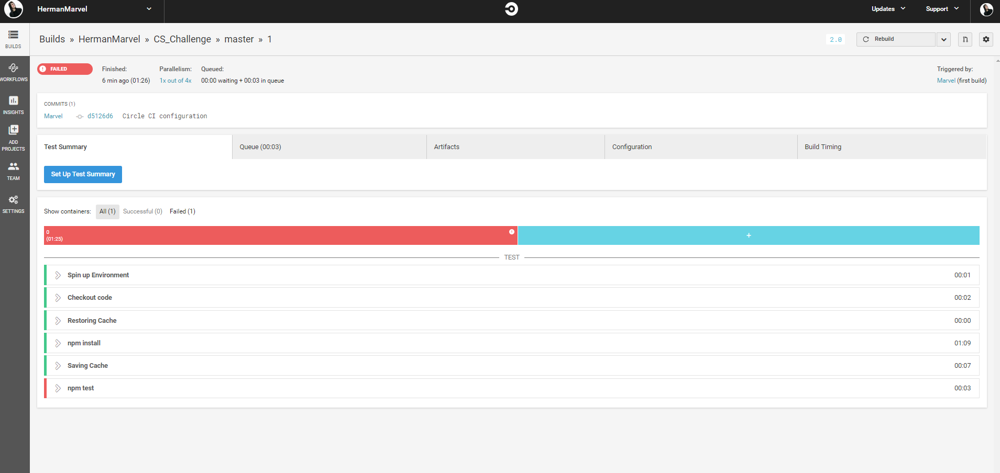

# CS_Challenge Overview

CS_Challnge is a repository that carry a test suite for CS team in order to test set of API endpoints and validate their JSON Schemas. 
Solution is based on node.js with support of mocha, chai and superagent. 

# RUN ON LOCAL HOST 

To run on localhost:
1. npm/yarn install
2. npm/yarn run test

Alterntatively run RUN_TESTS.sh that is based in the root directory. That will run a similar to Circle CI workflow except docker 
contenerisation part. 

# CIRCLE CI SETUP

Repository is binded with Circle CI worklow and tests are executed after every commit or on-demand from Circle CI: 

Negative Example: 

General Setup: 

